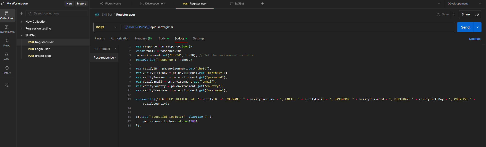

# **Import the json file in postman**

# **All variables that are needed for the tests to work.**

## **The raw json code has the same varaibles as values.**

## **The Pre-request allows to prepares values before sending the request.**

## **The Post-request executes lines of code after the request has been send**

# **Execute requests**

## **OPTION-1 straigh forward: should be sent in a specific order **

## **The order of execution :**

1. Register user
2. Login user
3. Create post

## **OPTION-2 : the better option**

1. **Click on the collection of the requests**
2. **Select Runs**
3. **Click on Run Collection**

### **After clicking on Run Collection**

#### Alot of options for testing the APi's are available now

- Like

* Run Manual tests (which will be enought for testing current program)

- Scheadule run

* Automate runs via CLI

#### In this case we will use manual runs

- Like

* setting the number of iteration

- The delay between each requests

(We don't need to import a Test data file because the user information are all generated in the scripts)

